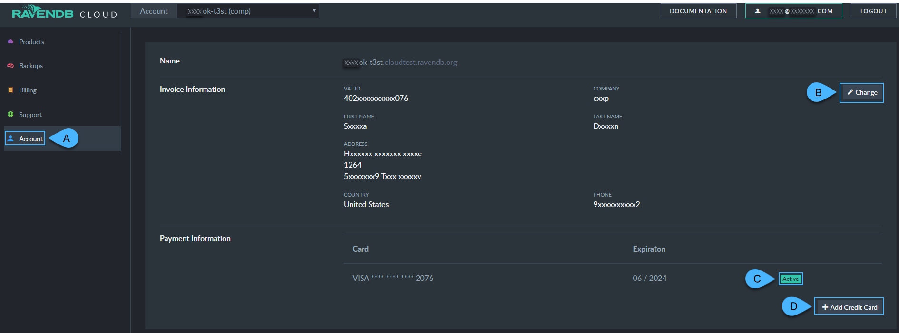

import Admonition from '@theme/Admonition';
import Tabs from '@theme/Tabs';
import TabItem from '@theme/TabItem';
import CodeBlock from '@theme/CodeBlock';
import LanguageSwitcher from "@site/src/components/language-switcher";
import LanguageContent from "@site/src/components/language-content";

# Cloud Portal: The Account Tab

<Admonition type="note" title="Note">

Use your portal's Account tab to control the details we'll include in your invoices, and your payment methods.  

* In this page:  
   * [The Account Tab](../../cloud/portal/cloud-portal-account-tab#the-account-tab)  
</Admonition>

---

<Admonition type="info" title="The Account Tab" id="the-account-tab" href="#the-account-tab">

  

* 
   **A**. The **Account** tab lets you view and edit your **Invoice** and **Payment** information.  
   **B**. Information you add/edit here appears on the payment invoices we provide you, normally at the end of the month.  
   **C**. Add/Edit payment methods here. The first we try to charge is always the one you choose as 
      [Active](../../cloud/cloud-pricing-payment-billing#credit-card).  
   **D**. Should charging the active payment method fail, we'll continue trying through your list.  

</Admonition>

## Related Articles
  
[Overview](../../cloud/cloud-overview)  

[The Products tab](../../cloud/portal/cloud-portal-products-tab)  
[The Backups Tab](../../cloud/portal/cloud-portal-backups-tab)  
[The Billing & Costs Tab](../../cloud/portal/cloud-portal-billing-tab)  
[The Support Tab](../../cloud/portal/cloud-portal-support-tab)  
  
**Links**  
[Register]( https://cloud.ravendb.net/user/register)  
[Login]( https://cloud.ravendb.net/user/login)  
