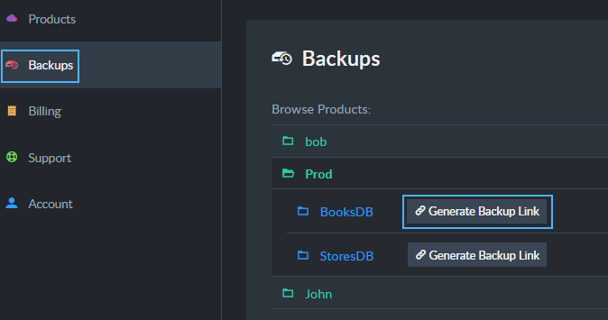

import Admonition from '@theme/Admonition';
import Tabs from '@theme/Tabs';
import TabItem from '@theme/TabItem';
import CodeBlock from '@theme/CodeBlock';
import LanguageSwitcher from "@site/src/components/language-switcher";
import LanguageContent from "@site/src/components/language-content";

# Cloud Portal: The Backups Tab

<Admonition type="note" title="Note">

Your RavenDB cloud products run [a mandatory backup routine](../../cloud/cloud-backup-and-restore#the-mandatory-backup-routine).  
Backup files created by this routine are stored in a RavenDB cloud you have no direct access to, but you can see their list 
from the portal's Backups tab and [restore them](../../cloud/cloud-backup-and-restore#restore-mandatory-backup-files) using your 
management Studio.  

* In this page:  
   * [Backups List](../../cloud/portal/cloud-portal-backups-tab#backup-files)  
</Admonition>

---

<Admonition type="info" title="Backup List " id="backup-list" href="#backup-list">

The Backups tab lists your products, their databases and their backup files.  
  

</Admonition>

## Related Articles

[Overview](../../cloud/cloud-overview)  
  
[The Products tab](../../cloud/portal/cloud-portal-products-tab)  
[The Billing & Costs Tab](../../cloud/portal/cloud-portal-billing-tab)  
[The Support Tab](../../cloud/portal/cloud-portal-support-tab)  
[The Account Tab](../../cloud/portal/cloud-portal-account-tab)  

**Cloud**  
[Cloud Backup And Restore](../../cloud/cloud-backup-and-restore)  
  
**Links**  
[Register]( https://cloud.ravendb.net/user/register)  
[Login]( https://cloud.ravendb.net/user/login)  
