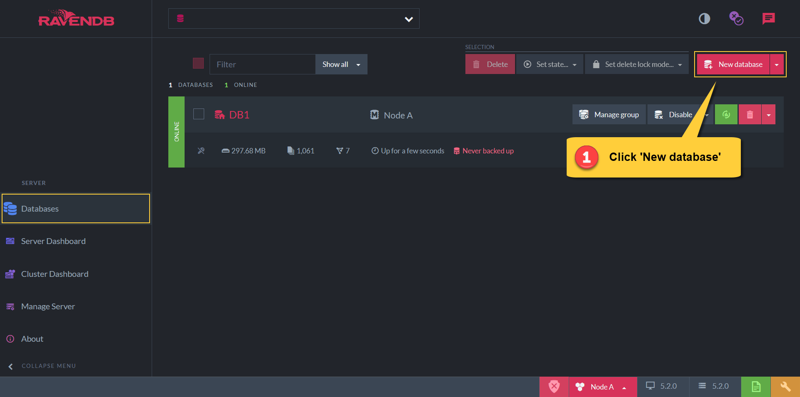
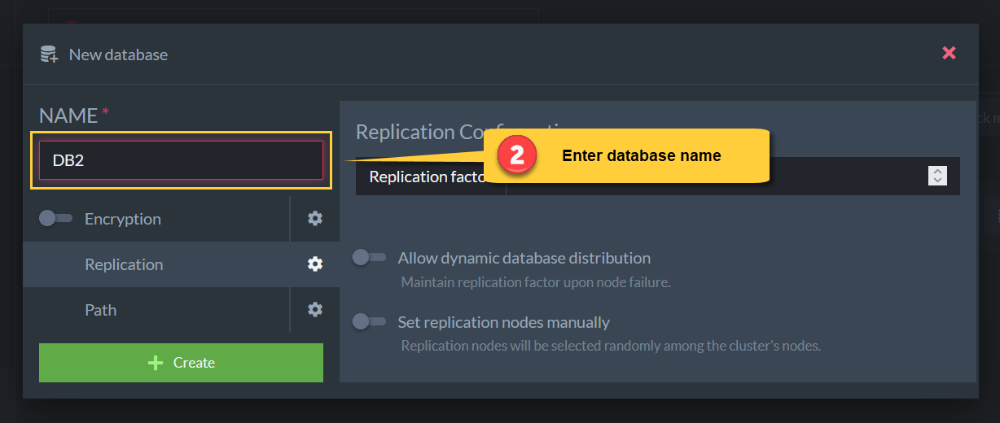
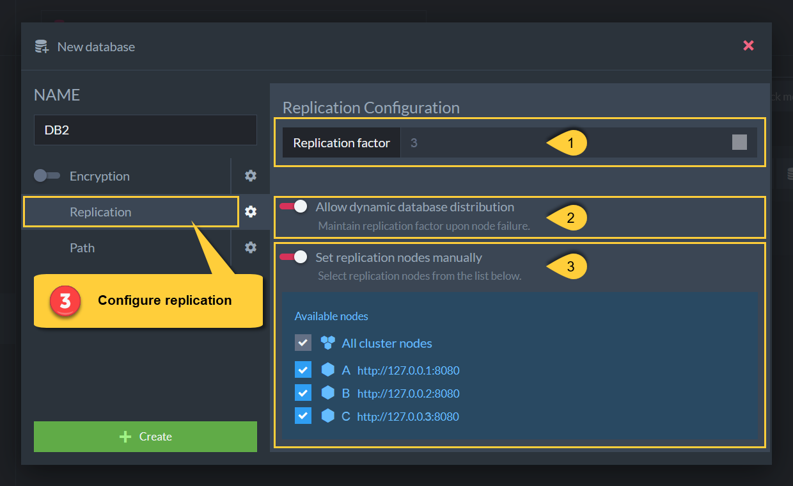
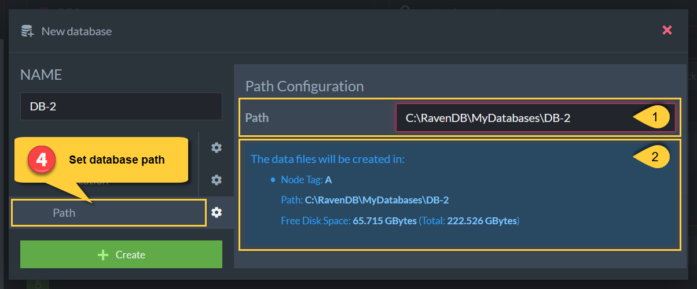
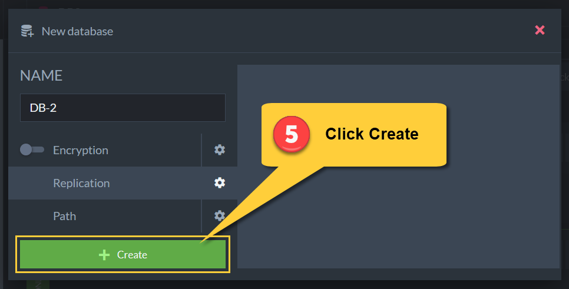

import Admonition from '@theme/Admonition';
import Tabs from '@theme/Tabs';
import TabItem from '@theme/TabItem';
import CodeBlock from '@theme/CodeBlock';
import LanguageSwitcher from "@site/src/components/language-switcher";
import LanguageContent from "@site/src/components/language-content";

# Create a Database: General Flow
---

<Admonition type="note" title="Note">

* From the Studio, the database creation options are:  
  * **Regular** database - see [below](../../../studio/database/create-new-database/general-flow#1.-new-database).  
  * **Encrypted** database - see [Encrypted Database](../../../studio/database/create-new-database/encrypted).  
  * Create a database from a **Backup** copy - see [From Backup](../../../studio/database/create-new-database/from-backup).  
  * Create a database from a **Previous** RavenDB version database - see [From Legacy File](../../../studio/database/create-new-database/from-legacy-files).  
  * Create a [Sharded](../../../sharding/overview) database - 
    see the [sharding Studio administration](../../../sharding/administration/studio-admin#creating-a-sharded-database) page.  

* To create a new database using the Client API, see [Create database operation](../../../client-api/operations/server-wide/create-database).

---

* In this article:  
  * [1. New Database](../../../studio/database/create-new-database/general-flow#1.-new-database)  
  * [2. Database Name](../../../studio/database/create-new-database/general-flow#2.-database-name)  
  * [3. Configure Replication](../../../studio/database/create-new-database/general-flow#3.-configure-replication)  
  * [4. Configure Path](../../../studio/database/create-new-database/general-flow#4.-configure-path)  
  * [5. Create](../../../studio/database/create-new-database/general-flow#5.-create)

</Admonition>

---

<Admonition type="info" title="1. New Database" id="1-new-database" href="#1-new-database">

<Admonition type="note" title="Note">
From the database list view, click the **'New database'** button.  
</Admonition>
</Admonition>

<Admonition type="info" title="2. Database Name" id="2-database-name" href="#2-database-name">

<Admonition type="note" title="Note">

* A database name can be any sequence of **letters**, **digits**, and characters that match the **regex**: **[ _ \ - \ . ]+**  
* A name cannot exceed 128 characters  
* Spaces are not allowed  
* If the name contains `.`, there must be some other character on both sides.  
* For example:  
  * car_orders_2018  
  * users.payments-2019  
</Admonition>
</Admonition>

<Admonition type="info" title="3. Configure Replication" id="3-configure-replication" href="#3-configure-replication">

<Admonition type="note" title="Note">

1. **Replication Factor:**  
   Set the number of nodes that will contain this database.   
   The minimum required number is 1.  
   The maximum number is the cluster size (number of nodes in the cluster).  

2. **Dynamic Database Distribution**  
   Upon a node failure, and if this option is checked, the RavenDB server will automatically replicate the database content to another available node in the cluster, 
   (one that doesn't already contain the database) so that replication factor is maintained.  

3. **Setting Replication Nodes Manually**  
   Select the specific initial replication nodes from the cluster for the database to replicate to.  
   If no node is checked, then the replication nodes will be selected randomly from the cluster.  
</Admonition>
</Admonition>

<Admonition type="info" title="4. Configure Path" id="4-configure-path" href="#4-configure-path">

<Admonition type="note" title="Note">

1. Set the directory path for the new database's data.  
   You can use any of the following options:  
   * **Write a full path**  
     (e.g. Windows: `C:/MyWork/MyDatabaseFolder`, Linux: `/etc/MyWork/MyDatabaseFolder` )  
      The database's data will be stored at the specified location.  
   * **Write a relative path**  
     (e.g. `MyWork/MyDatabaseFolder`)  
     The database's data will be stored at the specified location inside your server's **data directory** (see info below).  
   * **Leave field empty**  
     The database's data will be stored in the `Databases` directory inside your server's data directory.  

2. Information about the path you have chosen for your database's data.  
   * **Node Tag**: your server's cluster node tag - this indicates which server you're creating the new 
   database on.  
   * **Path**: your database data's full path.  
   * **Free Disk Space**: the amount of available space on the local disk.  

<Admonition type="info" title="The Data Directory" id="the-data-directory" href="#the-data-directory">

* By default, the server's data directory is at `Server/RavenData`. This contains a `Databases` directory, 
which contains the data of the different databases on the server.  
  (e.g. `Server/RavenData/Databases/MyDatabaseFolder`).  
  Learn more at [Storage: Directory Structure](../../../server/storage/directory-structure).  
* The location of the server's data directory can be set in the [`DataDir` configuration option](../../../server/configuration/core-configuration#datadir).  
* A path can't start with: `$home`, `~`, or `appdrive:`.  

</Admonition>

</Admonition>

</Admonition>

<Admonition type="info" title="5. Create" id="5-create" href="#5-create">

<Admonition type="note" title="Note">
Click **'Create'** to finish.  
</Admonition>
</Admonition>

